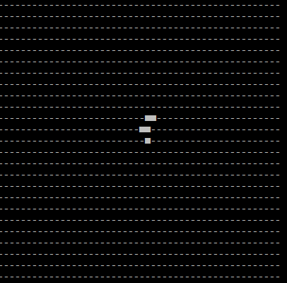

# Game-Of-Life

Conway's Game of Life ([Wikipedia](https://en.wikipedia.org/wiki/Conway%27s_Game_of_Life)) implemented in C# (.NET 10) as a console app.

Screenshot of the console application running, in this case with an [R_Pentomino](https://www.conwaylife.com/wiki/R-pentomino) starting pattern:



## Getting Started

Requires the [.NET 10 SDK](https://dotnet.microsoft.com/download).

```bash
dotnet build    # build the project
dotnet test     # run all tests
dotnet run      # start the simulation
```
